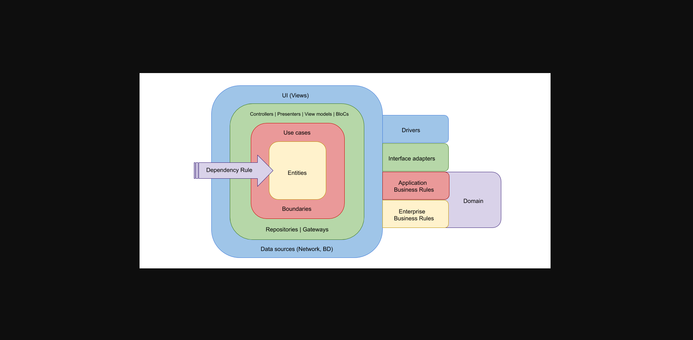

# Architecture

# Objectives

Esse documento tem por objetivo principal organizar o processo de desenvolvimento do software do projeto.

# Regras iniciais, limite e análise

Pontos a serem levados em consideração antes de introduzir uma nova feature ou hotfix:

- Todo código precisará respeitar as regras de Lint escritas no projeto.
- Esse projeto deve ter cobertura testes mínima de 60%.
- Todos os designs patterns usados no projeto devem estar listados na sessão “Design Patterns” desse documento, caso contrário será considerado implementação errônea.
- Packages e plugins novos só poderão ser usados nos projetos após avaliação e aprovação de toda equipe responsável pelo projeto.
- Atualizações no Modelo de domínio(Entities) só poderão ser aceitas se primeiro for adicionada nesse documento e aprovado por todos os envolvidos no projeto.
- Não é permitido ter uma classe concreta como dependência de uma camada. Só será aceita coesão com classes abstratas ou interfaces. Com exceção da Store.

## Padrões de nomeclatura:

- Deve-se preferir palavras completas ao invés de abreviações;
- dir names: kebab-case;
- file names: kebab-case;

### About Vue Files

- Utilizar Composition API, com a assinature/formato de `script setup` em arquivos;
- Utilização do componente, usar tag em _CamelCase_, eg: `<MyComponent />`
- Utilize sempre a assinatura: script(se houver) | template | style(se houver).
  eg:

```js
<script setup lang="ts">
</script>

<template>
</template>

<style scoped>
</style>
```

# Entidades

# Casos de Uso

# Design Patterns

- Seguir estratégias da Clean Architecture:
  

- Dependency Injection: Resolver dependências das classes e outros resources utilizados em qualquer funcionalidade.
- Observable: Entidade disponibiliza observers que executam gateways. O padrão Observer permite que qualquer objeto que implemente a interface do assinante possa se inscrever para notificações de eventos em objetos da publicadora. Você pode adicionar o mecanismo de inscrição em seus botões, permitindo que o cliente coloque seu próprio código através de classes assinantes customizadas;

# Packages(Dependencies)

- Dependências devem ter suas versões fixadas/pinadas:
  ex(package.json): `"axios": "1.3.4"`

## Prod Dependencies:

- axios: Promise based HTTP client for the browser;
- svg4everybody: Dependency necessary to install this 'polyfill' in your project to have the maximum support of browsers to SVG's.(Viking-weapons UI)
- vue - Progressive JS Framework;
- vue-router - Expressive, configurable and convenient routing for Vue.js;

## Dev Dependencies

- eslint, eslint-config-standard-with-typescript, eslint-plugin-import, eslint-plugin-n, eslint-plugin-promise, eslint-plugin-vue, @typescript-eslint/parser, @typescript-eslint/eslint-plugin: Is a tool for identifying and reporting on patterns found in ECMAScript/JavaScript code;
- @commitlint/cli, @commitlint/config-conventional: Linter for commit messages;
- @types/_some-package_ - Separated types to typescript intelisense;
- @vue/test-utils: ;
- husky: Modern native git hooks made easy;
- jsdom: A JavaScript implementation of many web standards, used by vitest;
- lint-staged: Run lint against staged git files;
- miragejs: A client-side server to develop, test and prototype your JavaScript app;
- sass: A pure JavaScript implementation of Sass;
- typescript: Is a language(SuperSet) for application scale JavaScript development;
- vite: Frontend Tooling;
- vite-plugin-eslint: ESLint plugin for vite;
- vitest: A blazing fast unit test framework powered by Vite;
- vue-tsc: Vue Type-Checking tool;
